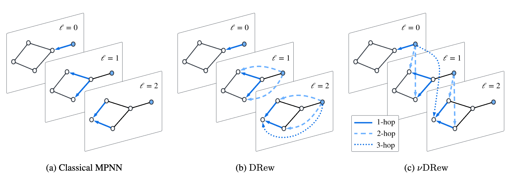

# DRew: Dynamically Rewired Message Passing with Delay



This repository contains the code required to reproduce the experimental results for the architectures described in the "[DRew: Dynamically Rewired Message Passing with Delay](https://arxiv.org/abs/2305.08018)" paper, accepted at ICML 2023.

The LRGB portion of the code is adapted from [here](https://github.com/vijaydwivedi75/lrgb) and the QM9 portion of the code is adapted from [here](https://github.com/radoslav11/SP-MPNN).

## Environment setup with conda
Configured for MacOS and Linux.
```bash
conda create -n drew python=3.9
conda activate drew
conda install pytorch=1.9.1 torchvision torchaudio -c pytorch -c nvidia   
conda install pyg=2.0.2 -c pyg -c conda-forge
pip install ogb
pip install performer-pytorch
pip install torchmetrics==0.7.2
conda install pandas scikit-learn
conda install openbabel fsspec rdkit -c conda-forge
pip install tensorboard
pip install tensorboardX
# Check https://www.dgl.ai/pages/start.html to install DGL based on your CUDA requirements
conda install -c dglteam dgl
conda install setuptools==58.0.4
pip install numba
pip install tabulate
```

## Reproducing LRGB experiments

From inside `/lrgb`, use:
```
python main.py --cfg {path_to_yaml_file}
```
All config files for LRGB experiments used in the paper are in `lrgb/configs/paper_configs`

Use custom arguments by appending the above with `{arg_name} {arg_val}`. See config files for arg options. 
E.g. to change the number of epochs append "`optim.max_epoch 100`"

## Reproducing QM9 experiments

From inside `qm9/src` use:

```
bash reproduce_qm9_results.sh
```

to reproduce results with the same seeds as used in the paper. More generally, run experiments using:

```
python main.py -d QM9 -m {model}_RSUM_WEIGHT --nu {nu} --max_distance {k} --num_layers 8 --specific_task -1 --emb_dim {d}
```

Using "`SP`" or "`DRew`" in place of `{model}` and using the `--nu` or `k` arguments to set the DRew rate parameter or SPN max-hop aggregation parameter, respectively.
Set `--emb_dim` to `95` for DRew models and `128` for SPN models to ensure ~800k parameter count.
The specific regression target can be chosen by setting `--specific task`, or set to `-1` to run through all 13 targets. 

A detailed list of all additional arguments can be seen using `python main.py -h`.


## Reproducing RingTransfer experiments
From inside `lrgb/configs/paper_configs/RINGTRANSFER` use:

```
bash run_ringtransfer_exps.sh
```

Generally experiments can be run in the same way as for the LRGB datasets, using `dataset.format synthetic` and `dataset.name RingTransfer` arguments.

Dataset generation code is adapted from [here](https://github.com/twitter-research/cwn/tree/main).


##  Citing this paper
If you make use of this code, or its accompanying paper,
please cite this work as follows:

```
@inproceedings{gutteridge2023drew,
  title={{DRew}: Dynamically Rewired Message Passing with Delay},
  author={Gutteridge, Benjamin and Dong, Xiaowen and Bronstein, Michael M and Di Giovanni, Francesco},
  booktitle={International Conference on Machine Learning},
  pages={12252--12267},
  year={2023},
  organization={PMLR}
}
```
